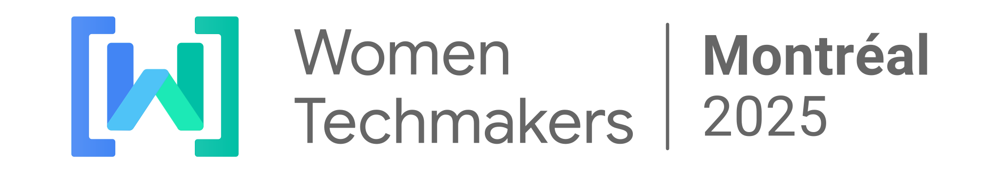

# Women Techmakers Montreal 2025

This is a [Next.js](https://nextjs.org/) project for the Women Techmakers Montreal 2025 event. It provides information about the event, including the schedule, speakers, team, and more.

## Table of Contents

- [About the Project](#about-the-project)
- [Built With](#built-with)
- [Getting Started](#getting-started)
  - [Installing Packages](#installing-packages)
  - [Running Locally](#running-locally)
  - [Running with Docker](#running-with-docker)
- [Updating Data](#updating-data)
  - [Using GitHub Codespaces](#using-github-codespaces)
- [Learn More](#learn-more)

## About the Project

This project is a web application built using Next.js, a React framework for building server-side rendered and statically generated web applications. It is designed to provide a comprehensive and engaging experience for attendees of the Women Techmakers Montreal 2025 event, with detailed information about the event, schedule, speakers, and more.

## Built With

- [Next.js](https://nextjs.org/)
- [React](https://reactjs.org/)
- [Tailwind CSS](https://tailwindcss.com/)

## Getting Started

### Installing Packages

First, install the necessary packages:

```bash
npm install
# or
yarn install
# or
pnpm install
# or
bun install
```

### Running Locally

After installing the packages, run the development server:

```bash
npm run dev
# or
yarn dev
# or
pnpm dev
# or
bun dev
```

Open [http://localhost:3000](http://localhost:3000) with your browser to see the result.

You can start editing the page by modifying `src/app/page.js`. The page auto-updates as you edit the files. You can jump [here](#updating-data) if you would only like to udpate the information.

### Running with Docker

To run the project using Docker, follow these steps:

1. Build the Docker image:

    ```bash
    docker-compose build
    ```

2. Run the Docker container:

    ```bash
    docker-compose up -d
    ```

3. Open [http://localhost:3000](http://localhost:3000) with your browser to see the result.

To stop the Docker container, run:

```bash
docker-compose down
```

## Updating Data

The data for the event, speakers, schedule, sponsors, team, and communities are stored in JSON files within the `src/locales` directory. You can update these files to change the content displayed on the website. The folders, `en` and `fr`, represents English and French language locales. Changing files in either of the locale folders will update content for that particular version on the website.

### Using GitHub Codespaces

GitHub Codespaces provides a cloud-based development environment that allows you to edit and run the project without installing any software on your local machine. To use GitHub Codespaces:

1. Open the repository on GitHub.
2. Click the `Code` button and select `Open with Codespaces`.
3. If you don't have a Codespace already, click `New codespace`.
4. Once the Codespace is ready, you can edit the files directly in the browser.
5. To run the project, open a terminal in the Codespace and run:

    ```bash
    npm install && npm run dev
    ```

6. Open the forwarded port to see the result.
7. Once commited, push the code to the repository.
## Learn More

To learn more about Next.js, take a look at the following resources:

- [Next.js Documentation](https://nextjs.org/docs) - learn about Next.js features and API.
- [Learn Next.js](https://nextjs.org/learn) - an interactive Next.js tutorial.
